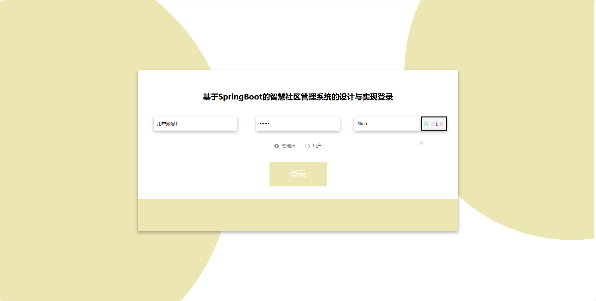

基于Springboot的智慧社区管理系统
=
### 完整代码获取地址：从戎源码网 ([https://armycodes.com/](https://armycodes.com/))
### 作者微信：19941326836  QQ：952045282 
### 承接计算机毕业设计、Java毕业设计、Python毕业设计、深度学习、机器学习
### 选题+开题报告+任务书+程序定制+安装调试+论文+答辩ppt 一条龙服务
### 所有选题地址https://github.com/nature924/allProject

一、项目介绍
---
基于Spring Boot框架实现的智慧社区管理系统，系统包含三种角色：管理员、用户主要功能如下。
### 【用户功能】
1. 首页：查看系统。
2. 超市商品：浏览超市中各类商品信息。
3. 动物信息：了解社区内的动物种类和相关信息。
4. 车位信息：查询社区内的停车位信息。
5. 便民服务：获取社区提供的各类便民服务信息。
6. 房屋信息：查看社区房屋的基本信息。
7. 物业人员：了解社区内的物业服务人员信息。
8. 社区公告：浏览社区发布的通知和公告。
9. 后台管理：进入用户的后台管理界面，包括编辑个人信息、查看订单信息等功能。
10. 个人中心：管理个人信息。

### 【管理员功能】
1. 系统首页：查看系统。
2. 个人中心：管理管理员个人信息。
3. 用户管理：维护系统用户的账户信息。
4. 商品分类管理：管理超市商品的分类信息。
5. 超市商品管理：发布、编辑和管理超市商品信息。
6. 动物种类管理：管理社区内动物的分类信息。
7. 动物信息管理：维护社区内动物的详细信息。
8. 车位信息管理：管理社区内停车位的信息。
9. 服务类型管理：维护社区提供的便民服务类型。
10. 便民服务管理：发布、编辑和管理便民服务信息。
11. 缴费信息管理：管理用户的缴费信息。
12. 房屋类型管理：管理社区房屋的分类信息。
13. 房屋信息管理：维护社区房屋的详细信息。
14. 物业人员管理：管理社区内的物业服务人员信息。
15. 订单信息管理：查看和管理用户的订单信息。
16. 反馈意见管理：查看和处理用户的反馈意见。
17. 系统管理：进行系统的基本设置。

二、项目技术
---
- 编程语言：Java
- 数据库：MySQL
- 项目管理工具：Maven
- 前端技术：VUE、HTML、Jquery、Bootstrap
- 后端技术：Spring、SpringMVC、MyBatis

三、运行环境
---
- 操作系统：Windows、macOS都可以
- JDK版本：JDK1.8以上都可以
- 开发工具：IDEA、Ecplise、Myecplise都可以
- 数据库: MySQL5.7以上都可以
- Tomcat：任意版本都可以
- Maven：任意版本都可以

四、运行截图
---
### 论文截图：

### 程序截图：

